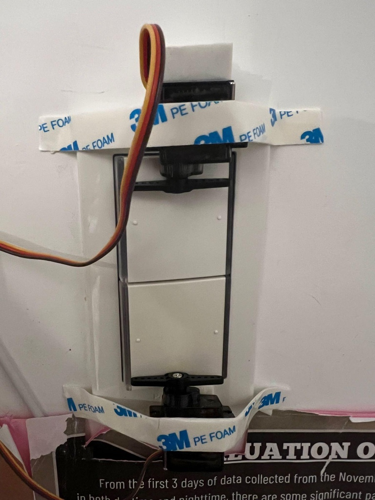
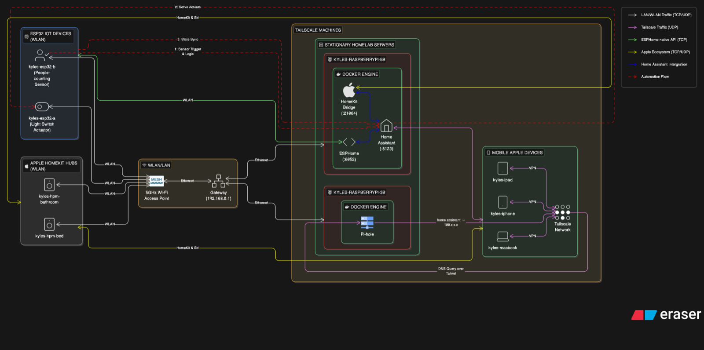
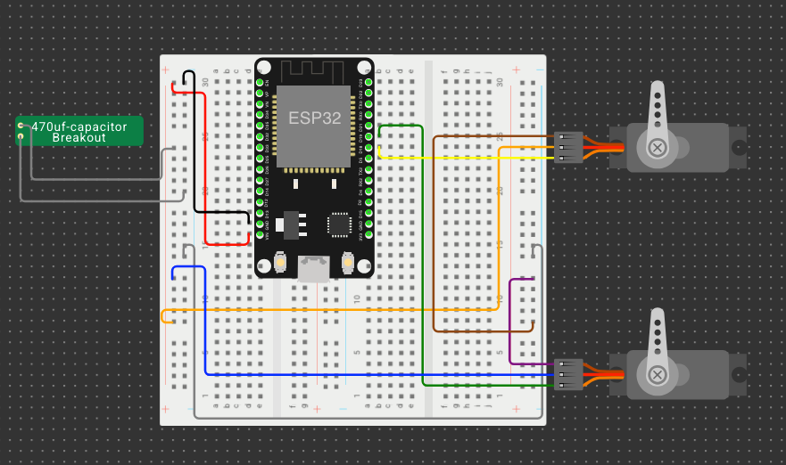
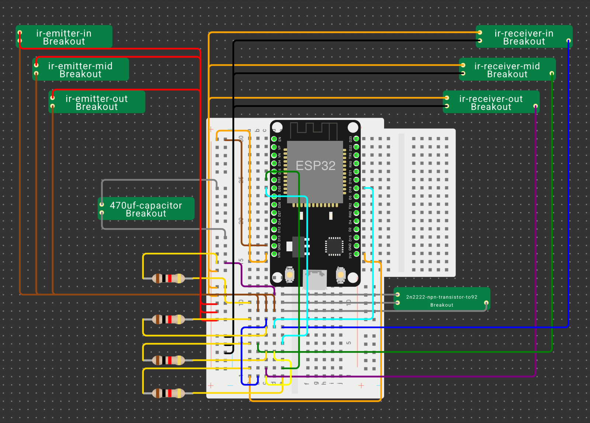
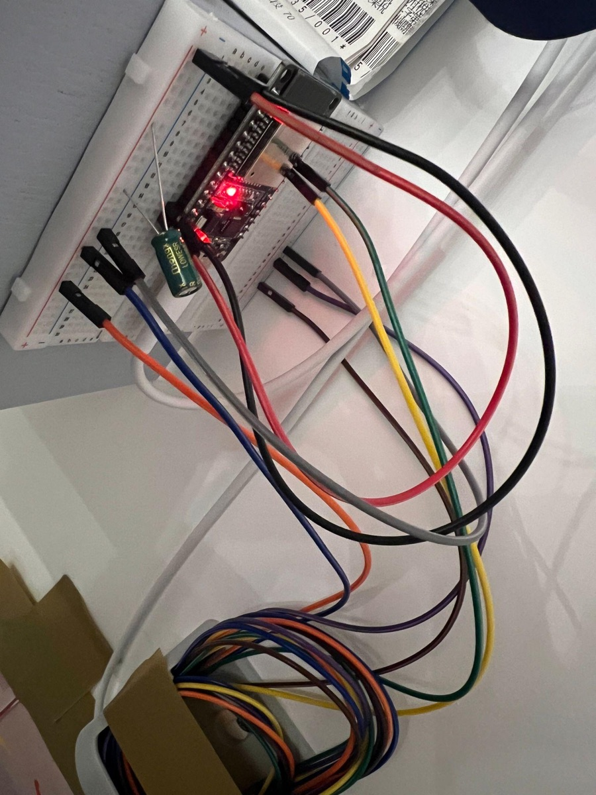

# ESPHome Smart Room

Two DIY ESP32 devices that make an ordinary bedroom light switch smart without rewiring it:

- **`kyles-esp32-a`, the light switch actuator.** Two servos physically press a two-gang wall switch (ceiling lights and desk lights).
- **`kyles-esp32-b`, the people counter.** Three IR break-beam sensors across the doorway count people entering and leaving.

Both run [ESPHome](https://esphome.io) and connect to a self-hosted [Home Assistant](https://www.home-assistant.io). When the room empties, the lights turn off. When someone walks in, they come back the way they were. The lights can also be controlled from the HA app, Apple Home or Siri.

This started as my **IB MYP Personal Project** (Grade 10), which was finished in **March 2026**. The configs in this repo are the current versions, which I kept improving after the project was submitted. See [What changed since the Personal Project](#what-changed-since-the-personal-project). The March 2026 versions are the first commit in this repo's history.

▶️ **1-minute demo:** https://youtu.be/X8RdsDESKhM



---

## Why

I often leave my room and forget the lights, or get into bed and realise they're still on. Smart switches mean rewiring 110 V mains. A servo that presses the existing switch doesn't. With a people counter at the door, the lights can follow whether anyone is actually in the room. That saves power without anyone having to think about it.

The project had three learning goals:

1. Apply basic electronics (Ohm's law, resistors, capacitors, transistors) safely.
2. Understand the network protocols IoT devices use to talk to each other (DNS, IP, TCP/UDP, HTTP, LAN/WLAN/WAN, VPN).
3. Write YAML configuration and automations.

The product goal was two custom IoT devices that integrate into Home Assistant and work together to automate the lights.

## How it works



1. **Sensor trigger & logic.** Board B sees the beams break in order. Outer → middle → inner is an entry, and inner → middle → outer is an exit. It publishes `Room Occupancy Count` to Home Assistant over the ESPHome native API.
2. **Automation.** Home Assistant runs **Enter Room** when the count rises above 0 and **Exit room** when it drops below 1.
3. **Servo actuate.** HA turns board A's `light` entities on or off, and board A presses the matching switch.
4. **State sync.** HA's HomeKit Bridge exposes the lights to Apple Home and Siri, and the Home Assistant app works remotely over Tailscale.

### Homelab it runs on

| Host | Runs |
|---|---|
| Raspberry Pi 5 | Home Assistant (+ HomeKit Bridge), ESPHome dashboard, Portainer. All in Docker. |
| Raspberry Pi 3B | Pi-hole (DNS, plus local names like `home.assistant`) |
| Tailscale | Secure remote access to all of it from my phone, iPad and laptop |

## Hardware

Total cost was about **US$25**, within the project's US$30 budget.

| Part | Spec | Qty |
|---|---|---|
| ESP32 DevKit V1 (CP2102) | USB-C | 2 |
| MG90S metal-gear servo | | 2 |
| IR break-beam sensor pair | 5 mm IR LED, ~1 m range, normally open | 3 |
| USB-C ↔ USB-A cable | 3 m, 3 A | 2 |
| USB-A wall adapter | 5 V 2 A | 2 |
| Electrolytic capacitor | 470 µF 16 V | 10 |
| Resistor kit | ¼ W | 1 |
| 2N2222 NPN transistor | TO-92 | 10 |
| Breadboard | 400-point | 2 |
| Jumper wires | 20 cm + 150 cm sets | 2 |
| 3M PE foam tape | for mounting | 1 roll |

### Pinout

**Board A (light switch actuator)**

| GPIO | Connected to |
|---|---|
| 18 | Top servo (ceiling lights), 50 Hz LEDC PWM |
| 19 | Bottom servo (desk lights), 50 Hz LEDC PWM |
| 2 | Onboard blue LED |



**Board B (people counter)**

| GPIO | Connected to |
|---|---|
| 32 | Outer beam receiver (hallway side) |
| 33 | Middle beam receiver |
| 18 | Inner beam receiver (room side) |
| 0 | Onboard BOOT button (pause modes, see below) |
| 2 | Onboard blue LED (status) |



The 470 µF capacitors sit across the 5 V rail to smooth the current spikes when a servo stalls against the switch.

## Repo layout

```
esphome/
  kyles-esp32-a.yaml            light switch actuator
  kyles-esp32-b.yaml            people counter
  kyles-esp32-airquality.yaml   bonus: SGP30 air-quality sensor (added Sep 2026)
  secrets.example.yaml          copy to secrets.yaml and fill in
home-assistant/
  automations.yaml              Enter Room / Exit room / Beam Issue / Air Quality
docs/images/                    diagrams and photos
```

## Setup

1. Copy `esphome/secrets.example.yaml` to `esphome/secrets.yaml` and fill it in. Generate a fresh API encryption key per device (the ESPHome dashboard does this when you create a device). `secrets.yaml` is git-ignored.
2. Flash each board from the ESPHome dashboard. Use USB the first time. After that it updates over the air.
3. Home Assistant auto-discovers both devices. Adopt them with their API keys.
4. Create a light group `light.bedroom_lights` containing both lights, plus the `input_boolean` helpers listed at the top of `home-assistant/automations.yaml`.
5. Import the automations. Entries that use raw hex `device_id`s are specific to my install, so re-pick those devices in the HA editor.
6. Optional: expose the lights through HA's **HomeKit Bridge** integration for Apple Home and Siri control.

## Results (Personal Project evaluation, March 2026)

| Criterion | Target | Result |
|---|---|---|
| Cost | < US$30 | ✅ US$25.07 |
| Function: actuator reliability | 50 consecutive toggles with no failure | ✅ 50/50 |
| Function: control | HA app + voice assistant | ✅ Both work (Siri via HomeKit Bridge) |
| Function: response | lights react within 1 s | ✅ Most survey respondents rated it fast enough |
| Function: counting accuracy | ≥ 90 % over 10+ events | ✅ Met in daily use (10+ events/day logged) |
| Noise | < 40 dB | ❌ Up to **74 dB** (servo clack) |
| Size / aesthetics | 10 × 10 × 5 cm, tidy | ⚠️ Partial: wired prototype, visible wiring |
| Safety | no exposed conductors | ⚠️ Partial: breadboard prototype has exposed leads |
| Customer (Gen Z survey, n = 10) | people would install it | ⚠️ NPS −30 (10 % promoters, 50 % passives, 40 % detractors) |

## Iterations during the project

A week of living with the first version turned up six problems:

1. **Regular tape let the servos slip off the switch.** Switched to 3M PE foam tape.
2. **Jumper wires fell out of the wall-mounted breadboard.** I rerouted them upward so gravity holds them in.
3. **Two outer beams 8 cm apart gave false and double triggers** from people passing in the hallway or carrying long objects. Added a third beam on the inside of the room.
4. **Popping out to the bathroom turned all the lights on when I came back**, even if I'd left them off or only had the desk lamp on. Added `lights_off` and `desk_lights_only` helpers. Exit room records the state and Enter Room restores it.
5. **Rapid toggling from Apple Home / HA overwhelmed the servos.** Switched the servo scripts to `mode: queued`.
6. **Automations pressed switches that were already in the right state**, which just made noise. Exit room now only turns off the lights that are actually on.



## What changed since the Personal Project

These changes came after submission (Aug–Sep 2026), from running the system every day.

### Board A: light switch actuator

- **Fixed a stuck-servo bug.** With `restore: true`, the servo saved its position to flash on every write. If the board browned out mid-press (a servo stalling against the switch causes exactly that current spike), it rebooted, drove back to the *pressed* position, and held the switch down. Now `restore: false`, and the servos are forced to neutral on boot.
- **Boot guard.** Servo presses are suppressed for 5 s after boot, so a restored light state can't trigger a phantom press.
- **One shared queued script for both servos.** Only one servo moves at a time, which halves peak stall current (the brownout cause above). The lights now switch about 2 s apart, and that's intentional.
- **Queue cap** (`max_runs: 6`). Spamming the toggle no longer leaves the servos clacking long after you stop.
- **Entry LED.** Board A's LED mirrors board B's new `Entry Pulse` sensor, so it lights when someone enters the room.

### Board B: people counter (counting logic rewritten)

The original used three global flags (`is_entering`, `is_exiting`, `step_reached`), armed by whoever broke a beam first. That broke in two ways I actually hit:

- Someone lingering at the door "armed" an entry, so the next person leaving was counted as **entering**.
- A 1.5 s lockout after every count meant a second person right behind the first was never counted, and the lights turned off with someone still inside.

The new logic works like this:

- Every beam break goes into a **timestamped event sequence**. Events older than 6 s age out one at a time, so a slow walk still counts but stale events never pair up.
- Re-triggering the same beam just refreshes its timestamp. Someone shuffling at the door can't advance the sequence.
- Any skipped beam or reversal mid-doorway **aborts** the pass instead of committing half of it.
- Completed passes are staged in a `pending_delta` and only **committed once the doorway is clear**. Two people passing together both count. A 30 s failsafe commits anyway if something is left blocking a beam.
- The count has a **hard ceiling of 5** to stop runaway counts, and is republished on boot so HA never sees `unknown`.
- **BOOT button pause modes:** single-click = *Skip Next Exit*, double-click = *Hold Lights On*, long-press = reset count to 0. They're also exposed as a `Light Auto-Off Mode` select in HA.
- **Status LED:** fast flash = count committed, slow blink = Skip Next Exit armed, solid = Hold Lights On.
- A **`Doorway Clear`** diagnostic sensor for checking beam alignment and polarity.

### Home Assistant

- Exit room also pauses whatever music is playing (a smart speaker or AirPlay). Enter Room resumes it.
- A **Beam Issue** push notification fires if any beam stays blocked for 10 s, which means a sensor has been knocked out of alignment.

### Bonus: air-quality sensor

`kyles-esp32-airquality`: a third ESP32 with a Sensirion **SGP30** (eCO₂ + TVOC over I²C, SDA = GPIO21, SCL = GPIO22), placed near my 3D printer. It samples every 1 s, which the SGP30's baseline algorithm requires, and publishes every 15 s. HA sends a push notification if TVOC stays above 600 ppb for 5 minutes. The SGP30 is an index sensor, so treat it as "did something spike", not as a calibrated measurement.

## Known limitations / next steps

- **Open-loop light state.** Board A's lights are `platform: binary` with no feedback from the physical switch. If a press misses, or someone flips the switch by hand, HA's state is inverted until it's resynced. A light sensor or current clamp on the fixture would fix this.
- **Noise.** The servos hit 74 dB. A sound-damping enclosure or quieter actuators would help.
- **Enclosure.** Exposed breadboards and leads should become a 3D-printed case.
- **Pause modes aren't wired into Exit room yet.** The select exists on board B, but the automation doesn't check it.
- **Servo power.** The servos should get their own 5 V supply and a bigger bulk capacitor instead of sharing the ESP32's rail.

## License

[MIT](LICENSE)
